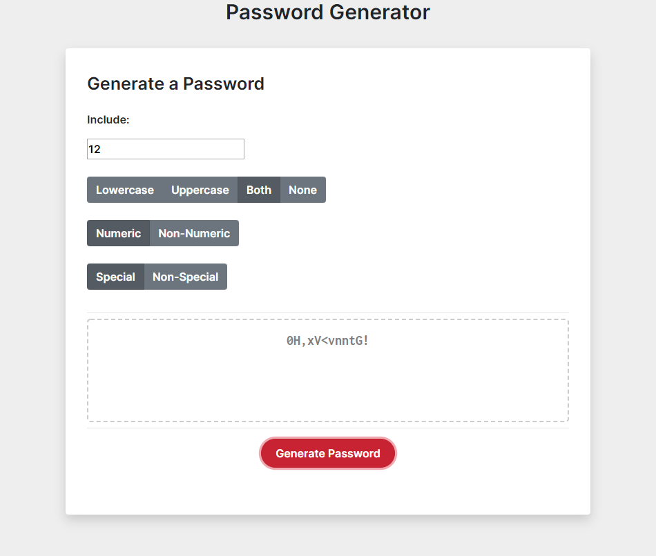

# Password Generator

----------------------------------------------------------
## Description
----------------------------------------------------------

Takes a number of inputs from the user to generate a random, secure password for them to use. User input is validated before password generation.

Input options include:
* Number of Characters - Can be between 8 and 128
* Character Case - Can include uppercase characters, lowercase characters, both upper and lowercase characters, or include no alpha characters at all
* Numerical Characters - Whether to include numerical characters in the password or not
* Special Characters - Whether to include special characters in the password or not

Should a user's input be invalid, no password is generated, and the user can reset their preferences to be valid.

Invalid inputs include:
* A number of characters outside of the valid range [8-128]
* A password that contains no possible characters, i.e alpha characters are disabled, numerical characters are disabled, and special characters are disabled.

----------------------------------------------------------
## Usage
----------------------------------------------------------

The Password Generator can be accessed here: [Link](https://bounty556.github.io/PasswordGenerator/)

Here is an example run and output of the program:

----------------------------------------------------------
## Credits
----------------------------------------------------------

* [Boostrap](https://getbootstrap.com/)
* [Google Fonts](https://fonts.google.com/)

----------------------------------------------------------
## License
----------------------------------------------------------

MIT License

Copyright (c) 2020 Jacob Peterson

Permission is hereby granted, free of charge, to any person obtaining a copy
of this software and associated documentation files (the "Software"), to deal
in the Software without restriction, including without limitation the rights
to use, copy, modify, merge, publish, distribute, sublicense, and/or sell
copies of the Software, and to permit persons to whom the Software is
furnished to do so, subject to the following conditions:

The above copyright notice and this permission notice shall be included in all
copies or substantial portions of the Software.

THE SOFTWARE IS PROVIDED "AS IS", WITHOUT WARRANTY OF ANY KIND, EXPRESS OR
IMPLIED, INCLUDING BUT NOT LIMITED TO THE WARRANTIES OF MERCHANTABILITY,
FITNESS FOR A PARTICULAR PURPOSE AND NONINFRINGEMENT. IN NO EVENT SHALL THE
AUTHORS OR COPYRIGHT HOLDERS BE LIABLE FOR ANY CLAIM, DAMAGES OR OTHER
LIABILITY, WHETHER IN AN ACTION OF CONTRACT, TORT OR OTHERWISE, ARISING FROM,
OUT OF OR IN CONNECTION WITH THE SOFTWARE OR THE USE OR OTHER DEALINGS IN THE
SOFTWARE.